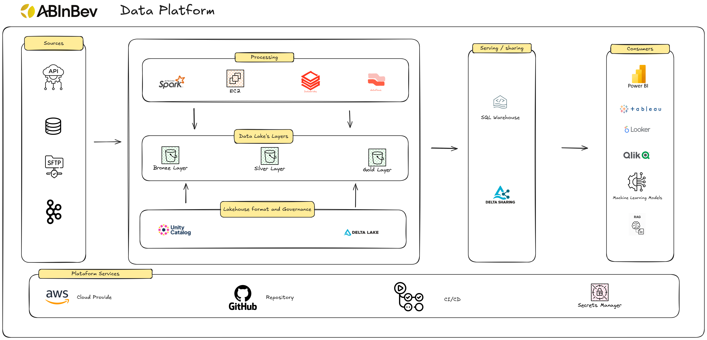
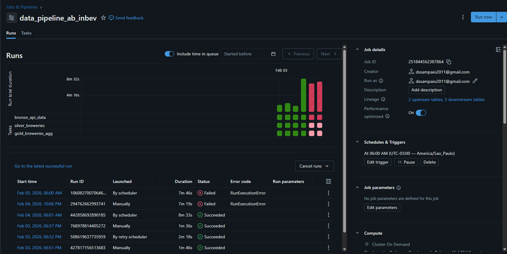

# BEES Data Engineering Case - AbInBev

## About

This project was developed as part of a selection process for the **Data Engineer** position at **AB InBev**, aiming to demonstrate skills in data ingestion, transformation, modeling, and data provisioning using **Databricks**, **Apache Spark**, and **Delta Lake**.

## Case Goal

Build a data pipeline capable of:

- Consuming data from the **Open Brewery DB API**  
  https://www.openbrewerydb.org/documentation#list-breweries
- Persisting data into a **Data Lake using Medallion Architecture**
- Supporting **schema evolution without reprocessing the source**
- Creating an aggregated analytical layer for business consumption
- Demonstrating good data engineering practices in a Databricks environment

---

## Solution Architecture

The adopted architecture clearly separates responsibilities across layers, ensuring scalability, governance, and ease of evolution.

### Fig. 01 - Solution Architecture

[Link](https://excalidraw.com/#json=bVOMVhZ58q-Ao76OVaGpM,zsrmFLnhIwGqhkKG12J98Q) to Excalidraw

This solution was designed based on Databricks best practices:

- [Medallion Architecture](https://www.databricks.com/glossary/medallion-architecture)
- [Data Lakehouse](https://www.databricks.com/glossary/data-lakehouse)

---

## Bronze Layer - Raw Data (Delta Lake)

- Data ingestion directly from the API
- Persistence in **Delta Lake**
- Data stored without business transformations
- Structure kept close to the original source format
- Data partitioned by **ingestion/execution date**

### Why use Delta Lake in the Bronze layer?

Despite being a raw data layer, using **Delta Lake** in Bronze was an intentional architectural decision to:

- Support **schema evolution**
- Handle API version changes (e.g., V1 → V2)
- Avoid reprocessing historical data
- Ensure data versioning and reliability from ingestion

This approach preserves the raw data concept while adding operational robustness.

### Evolution of Schema without API Reprocessing

By persisting raw data in Delta Lake, the pipeline can gracefully absorb structural changes in the API, such as:

- Addition of new fields
- Changes in compatible data types
- Expansion of location-related attributes
- API evolution across versions

Delta Lake enables:

- Automatic schema merging
- Reading previous versions of data
- Incremental model evolution

This decouples ingestion from transformation, reducing operational costs and increasing pipeline resilience.

---

## Silver Layer - Curated Data

- Cleaned and standardized data
- Maintains columnar storage format (Delta/Parquet)
- Partitioning by brewery location
- Prepared for analysis and aggregation

Transformations applied include:

- Standardization of column naming conventions:
  - `ds_` - description
  - `nm_` - name
  - `cd_` - code
  - `nr_` - number
- Schema enforcement, data typing, and error handling
- Standardization of geographic fields

---

## Gold Layer - Analytics

This layer is dedicated to analytical and business consumption, containing aggregated and optimized datasets.

The data model may follow **OBT**, **Star Schema**, or **Snowflake Schema** patterns.

For this case, an **OBT (One Big Table)** was created with:

- Number of breweries by **type**
- Number of breweries by **location**

This layer is ready for consumption by BI tools, dashboards, exploratory analytics, and advanced use cases such as **AI/ML and RAG-based applications**.

---

## Technologies Used

- **AWS** - Cloud provider (Databricks running on AWS, with S3 as the storage layer)
- **Databricks** - Platform as a Service (PaaS)
- **Apache Spark / Python** - Data processing and transformation
- **Delta Lake** - Storage layer with ACID guarantees
- **Unity Catalog** - Data governance and catalog
- **Databricks Workflows** - DAG-based orchestration
- **GitHub** - Source code repository

---

## Data Pipeline

### Fig. 02 - API ingestion to Gold Layer using Databricks Workflows

---

## Directory Structure and Data Flow

### 01_Bronze
- `fetch_api_breweries` - Fetches data from the API and loads it into the Data Lake

### 02_Silver
- `silver_breweries` - Cleans data and normalizes columns and schema

### 03_Gold
- `breweries_agg` - Aggregated analytical dataset

The DAG was configured with task dependencies, retries, and failure notifications via email (and can be easily extended to Slack or Microsoft Teams), ensuring fault tolerance and operational reliability.

---

### Fig. 03 - DAG

---

### Fig. 04 - Monitoring

Example of how retry and alerts work.

---

## Design Decisions and Trade-offs

- Use of Delta Lake from the Bronze layer to ensure resilience and schema evolution
- Medallion Architecture to enforce separation of responsibilities
- Focus on simplicity and clarity over excessive abstraction
- Pipeline designed for future evolution (new data sources and domains)
- Databricks used as a unified platform for **Data Engineering, Analytics, and Data Science**
